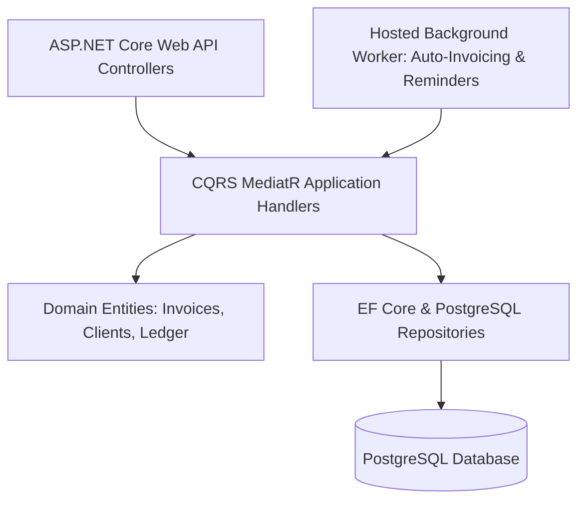

# .NET Freelancer Finance & Invoice Management Platform

<div align="center">

[](https://github.com/abdussatarkhan)
[](https://github.com/abdussatarkhan/abdussatarkhan)
[](https://github.com/abdussatarkhan)

</div>


[](https://github.com/abdussatarkhan/dotnet-freelancer-finance-tracker/actions)
[](https://learn.microsoft.com/en-us/dotnet/) [](https://learn.microsoft.com/en-us/dotnet/csharp/) [](https://www.postgresql.org/) [](https://www.docker.com/)
[](https://github.com/abdussatarkhan)

> **A Clean Architecture ASP.NET Core Web API and background service platform with PostgreSQL and Entity Framework Core — managing freelance client contracts, automated recurring invoicing, multi-currency revenue analytics, and tax forecasting.**

---

## 🏛️ System Architecture



---

## 🌟 Key Features & Capabilities

- **Production-Grade Implementation**: Built with modular design patterns, type safety, and clean separation of concerns.
- **Robust Ledger & Data Persistence**: ACID-compliant transactions and optimized queries.
- **Comprehensive Tech Stack**: `C#` `ASP.NET Core` `.NET 8` `EF Core` `PostgreSQL` `Clean Architecture` `Docker`.

---

## 🚀 Quickstart & Setup

### 1. Clone the Repository
```bash
git clone https://github.com/abdussatarkhan/dotnet-freelancer-finance-tracker.git
cd dotnet-freelancer-finance-tracker
```

---

## 🗺️ Roadmap & Upcoming Features

- [x] ASP.NET Core Web API with CQRS MediatR architecture
- [x] PostgreSQL database and recurring billing background workers
- [ ] Multi-currency exchange rate live API sync
- [ ] Automated PDF invoice email delivery
- [ ] Quarterly tax liability forecasting module

---

## 👨‍💻 Author & Profile

Built and maintained by **Abdussatar** ([@abdussatarkhan](https://github.com/abdussatarkhan)).  
For collaboration or queries, feel free to reach out via [LinkedIn](https://www.linkedin.com/in/abdus-satar-5150813b5/) or [GitHub](https://github.com/abdussatarkhan).

---

## 📜 License

This project is licensed under the **MIT License** — see the LICENSE file for details.


---

<div align="center">

### 👨‍💻 Maintained by [Abdussatar (@abdussatarkhan)](https://github.com/abdussatarkhan)
Part of the **[Master Enterprise Data Analytics & AI Portfolio](https://github.com/abdussatarkhan/abdussatarkhan)**.

⭐ If you find this repository valuable, consider dropping a star! ⭐

</div>
