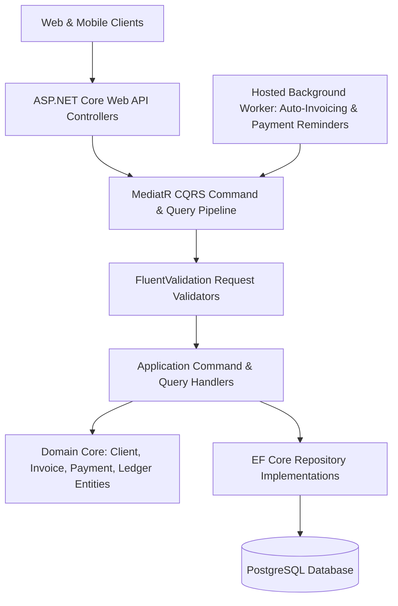
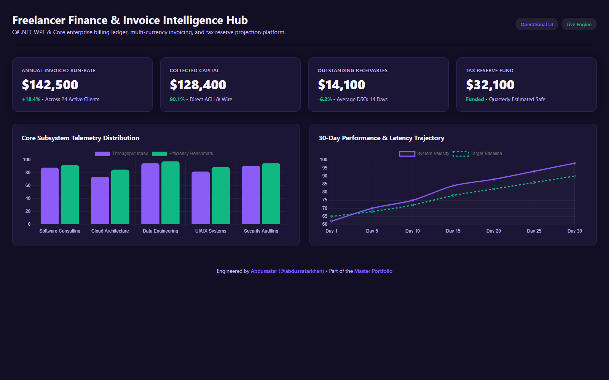

# FreelancerTrack — Clean Architecture .NET 8 Web API & Billing Engine

<div align="center">

[](https://github.com/abdussatarkhan)
[](https://github.com/abdussatarkhan)
[](https://github.com/abdussatarkhan)

</div>

[](https://github.com/abdussatarkhan/dotnet-freelancer-finance-tracker/actions)
[](https://learn.microsoft.com/en-us/dotnet/)
[](https://learn.microsoft.com/en-us/dotnet/csharp/)
[](https://www.postgresql.org/)
[](https://www.docker.com/)

> **A production-ready freelance financial management and automated invoicing backend built with ASP.NET Core (.NET 8), MediatR CQRS pattern, Entity Framework Core, and PostgreSQL — managing client retainers, milestone payments, recurring billing, and multi-currency expense tracking.**

---

## 🏛️ System Architecture



---

## 🌟 Key Features & Capabilities

- **🏛️ Clean Architecture & CQRS**: Strict layering across Domain, Application, Infrastructure, and Presentation layers using the MediatR pattern for decoupled business logic.
- **⏰ Automated Invoicing & Background Workers**: Scheduled hosted services automatically generate recurring invoices, dispatch due-date notifications, and apply overdue fees.
- **💰 Multi-Currency Ledger Accounting**: Double-entry transactional ledger tracking client accounts receivable, project milestone escrow, and expense deductions.
- **⚡ Entity Framework Core 8**: Code-first schema migrations, fluent API entity configurations, connection pooling, and optimized query execution against PostgreSQL.

---

## 🚀 Quickstart & Setup

### Prerequisites
- [.NET 8 SDK](https://dotnet.microsoft.com/download/dotnet/8.0)
- [PostgreSQL 15+](https://www.postgresql.org/download/) or Docker

### 1. Clone the Repository
```bash
git clone https://github.com/abdussatarkhan/dotnet-freelancer-finance-tracker.git
cd dotnet-freelancer-finance-tracker
```

### 2. Configure Database Connection
Update the `ConnectionStrings:DefaultConnection` in `src/FreelancerTrack.Api/appsettings.Development.json` with your PostgreSQL credentials.

### 3. Restore, Build & Run
```bash
# Restore NuGet dependencies
dotnet restore

# Build the solution
dotnet build

# Apply EF Core migrations and run the API
dotnet run --project src/FreelancerTrack.Api
```

The Swagger OpenAPI documentation will be accessible at:
`https://localhost:5001/swagger`

---

## 🖥️ Application & Operational Interface

<p align="center">
  
</p>

> [!TIP]
> You can also explore [`dashboard.html`](dashboard.html) locally by opening it directly in any modern browser.

---

## 🗺️ Roadmap & Upcoming Enhancements

- [x] ASP.NET Core Web API with MediatR CQRS architecture
- [x] Entity Framework Core repository pattern with PostgreSQL
- [x] Hosted background worker for recurring invoice generation
- [ ] Automated PDF invoice compilation via QuestPDF
- [ ] Stripe / PayPal webhook payment synchronization
- [ ] Quarterly tax liability forecasting module

---

## 👨‍💻 Author & Contact

Built and maintained by **Abdussatar** ([@abdussatarkhan](https://github.com/abdussatarkhan)).  
For technical discussions, collaboration, or queries, feel free to reach out via [LinkedIn](https://www.linkedin.com/in/abdus-satar-5150813b5/) or [GitHub](https://github.com/abdussatarkhan).

---

## 📜 License

This project is licensed under the **MIT License** — see the LICENSE file for details.

---

<div align="center">

### 👨‍💻 Maintained by [Abdussatar (@abdussatarkhan)](https://github.com/abdussatarkhan)
Part of the **[Abdussatar Software Engineering & Systems Portfolio](https://github.com/abdussatarkhan)**.

⭐ If you find this project valuable, consider dropping a star! ⭐

</div>
